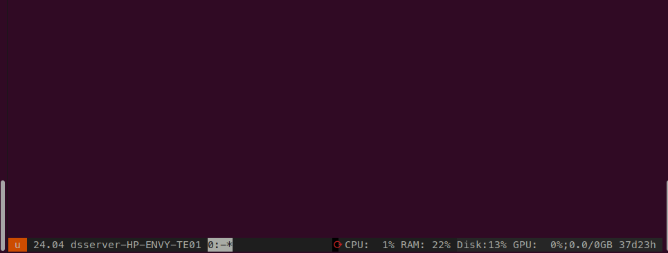

# byobu-config


---

## Scope

- `byobu`のセットアップ用レポジトリ
- `/byobu_config`は `~/.byobu` ディレクトリのうち特にユーザー側で変更したスクリプトを格納
- 基本的にはUbuntu OSを想定したセットアップを実施している

## 機能



**Left Status**

- OS 情報
- hostname
- Window 情報

**Right Status**

- reboot required の有無
- CPU使用率
- メモリ使用率
- Disk使用率
- GPU使用率 / VRAM使用率
- uptime

## Installation

1. `/byobu_config` を`~/.byobu`にコピーする or `bash install.sh`を実行する
2. `/bin`ディレクトリのファイルに関してはコピー時に実行権限を`chmod +x`で付与する


## Dependency

|プログラム|説明|インストール|
|---|---|---|
|`gpustat`|GPU使用状況計測プログラム|`pipx install gpustat`|

## Customization

### Editorの選択

`select-editor`を実行することで，printscreenの表示先など，`byobu`がデフォルトで開くエディタを選択することができる：

```zsh
% select-editor

Select an editor.  To change later, run 'select-editor'.
  1. /bin/nano        <---- easiest
  2. /usr/bin/vim.basic
  3. /usr/bin/nvim
  4. /usr/bin/vim.tiny
  5. /usr/bin/code
  6. /bin/ed
```
